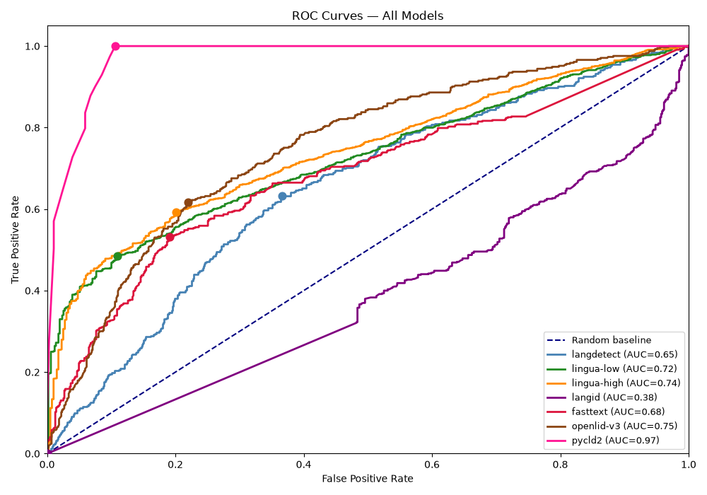

# Language Detection Engine Evaluation

[](https://github.com/paksopi/Language-Detection-Analysis/actions/workflows/tests.yml)
[](LICENSE)


A proof-of-concept comparing language-detection engines — **lingua**, **langdetect**,
**pycld2**, **fasttext**, and **langid** — on short-text EN / MS / ID (English / Malay /
Indonesian) classification, and combining them into a weighted voting ensemble.

## Dataset

The main evaluation dataset is `data/test_case_7_enmyid.txt` — 1,273 English/Malay/Indonesian
cases in `LANG | text` format, filtered from the 5-language `test_case_7.txt` (2,036 cases,
which also includes Chinese and Tamil). Cases are organized into five word-count buckets so
accuracy and speed can be measured per bucket per language, not just overall:

| Bucket | n | Description |
|---|---|---|
| 1 word | 677 | 50% shared/formal roots (stress-tests EN/MY/ID ambiguity), 50% exclusive/colloquial (tests distinct dialect routing) |
| 2 words | 399 | Same 50/50 shared-root / colloquial split as bucket 1 |
| 3–7 words | 94 | Authentic Bahasa Rojak, code-switching patterns |
| 8–16 words | 73 | Localized slang, multi-word educational phrases |
| 17–50 words | 30 | Full sentences, educational content, paragraphs |

Earlier, smaller test cases (`test_case_1.txt` through `test_case_6.txt`) are kept in `data/`
for history — see the archived reports in `reports/archive/` for the runs that used them. Labels
are scored as exact-match [BCP 47](https://www.rfc-editor.org/info/bcp47) codes (`en`, `ms`, `id`).

## Results

Evaluated on 1,273 EN/MY/ID short-text cases (`test_case_7_enmyid.txt`). Current production
baseline (`langdetect` alone) scores **29.1%** overall accuracy and cannot detect Malay at all
(0.0% MY). The recommended **Scenario 2 Weighted Voting** ensemble (`lingua-high` + `openlid-v3`
+ `pycld2`) reaches **70.8%** overall accuracy — **+41.7 pp** — while running 8.6–115.5× faster
per call.

| Strategy | Ensemble | EN | MY | ID | ALL |
|---|---|---|---|---|---|
| langdetect (current production) | — | 42.8% | 0.0% | 44.3% | 29.1% |
| lingua-high (individual) | — | 92.1% | 55.8% | 57.9% | 68.8% |
| S1 two_stage_weighted | ld+li+py (2-stage) | 92.4% | **56.5%** | 61.4% | 70.3% |
| **S2 weighted (recommended)** | ol+li+py | 92.1% | 43.7% | **76.0%** | **70.8%** |



`pycld2` is the most discriminative single model by AUC (0.97), but its raw accuracy alone is
low (§1 of the report) — it needs the other voters to convert that discriminative power into
correct calls. Full ROC methodology in [§1.5 of the report](reports/language_detection_ensemble_evaluation.md#15-roc-auc-analysis).

### Speed & complexity (Scenario 1 vs. Scenario 2)

Scenario 2 (recommended) wins on steady-state latency but costs more to deploy:

| Dimension | S1 (`lingua`+`langdetect`+`pycld2`) | S2 (`lingua`+`openlid-v3`+`pycld2`) |
|---|---|---|
| Per-request latency (1-word text) | 5.5216 ms | 0.0478 ms (**115.5× faster**) |
| Per-request latency (17–50 words) | 2.1027 ms | 0.2435 ms (**8.6× faster**) |
| Model artifact size | ~2.3 MB | **1.2 GB** (`openlid-v3.bin`) |
| Cold-start load time | ~0.242 s | ~1.155 s (~4.8× slower) |
| Routing logic needed | Two-stage voting required to protect MY accuracy | Single-stage vote, no routing |

Since detection runs synchronously before any downstream NLP stage, per-request latency dominates
in production; the 1.2 GB artifact and slower cold start are one-time costs paid at deploy/restart,
not per request. Full breakdown in [§10 of the report](reports/language_detection_ensemble_evaluation.md#10-scenario-comparison--speed-accuracy--complexity).

## Layout

All code lives under `src/`, grouped by purpose:

| Folder | Contents |
|---|---|
| `src/voting/` | Core voting-ensemble logic and evaluation scripts (accuracy, kappa, AUC, reproducibility, two-stage voting) |
| `src/voting/scenario2/` | A second voting scenario variant (`voting_s2*.py`), built on `src/voting/core.py` |
| `src/benchmark/` | Single-engine benchmark script producing confusion matrices and ROC curves |
| `src/examples/` | Earlier standalone demo/comparison scripts (lingua vs. langdetect, iterative versions) — kept for history, not part of the main pipeline |
| `models/` | Pretrained language-ID model binaries (`lid.176.ftz`, `openlid-v3.bin`) |
| `data/` | Test-case text files used as evaluation input |
| `results/` | Generated artifacts: `logs/`, `logs_scenario2/`, `calibration/`, `confusion_matrix/`, `roc_curve/` — all reproducible by re-running the scripts above |
| `reports/` | Written analysis of results — see [`reports/language_detection_ensemble_evaluation.md`](reports/language_detection_ensemble_evaluation.md) for the current canonical report. Superseded drafts/earlier runs live in `reports/archive/`. |
| `tests/` | Unit tests (pytest) for the pure, model-free functions in `src/voting/core.py` |

## Setup

Requires **Python 3.12** — `pycld2`, `langid`, and `statsmodels` don't yet have prebuilt
wheels for newer Python versions. `requirements.txt` installs `fasttext-wheel` rather than
the official `fasttext` package, since `fasttext` has no prebuilt Windows wheel and fails
to compile from source on newer MSVC/pybind11 toolchains — `fasttext-wheel` is a drop-in,
prebuilt-wheel fork; the import name is still `import fasttext`.

```bash
python3.12 -m venv .venv
.venv\Scripts\activate      # Windows
pip install -r requirements.txt
pip install -e .             # registers voting/benchmark as importable packages
```

`models/openlid-v3.bin` (1.2 GB) is excluded from this repo via `.gitignore` — it's too large
for a normal git push. Download it separately from [Hugging Face](https://huggingface.co/HPLT/OpenLID-v3)
and place it at `models/openlid-v3.bin` before running any `openlid-v3` scripts.

## Usage

Run the main benchmark:

```bash
python src/benchmark/benchmark.py [path/to/test_case.txt]
```

Run the voting ensemble evaluation:

```bash
python src/voting/voting_main.py
```

Scripts write logs/plots into `results/`, keyed by test case, and default to
`data/test_case_7_enmyid.txt` if no input file is given.

## Tests

```bash
python -m pytest tests/
```

## Model attribution

`models/lid.176.ftz` is Facebook/Meta's pretrained fastText language-identification model,
redistributed here unmodified. It is licensed under
[CC BY-SA 3.0](https://creativecommons.org/licenses/by-sa/3.0/), trained on data from
Wikipedia, Tatoeba, and SETimes. See [fastText's language-identification
docs](https://github.com/facebookresearch/fastText/blob/main/docs/language-identification.md)
for details. `models/openlid-v3.bin` is excluded from this repo via `.gitignore` (see
[Setup](#setup)) and is not redistributed here.

## References

### Language detection libraries evaluated

- [lingua-py](https://github.com/pemistahl/lingua-py) — natural language detection library, tuned for short and mixed-language text
- [langdetect](https://github.com/Mimino666/langdetect) — Python port of Google's language-detection library
- [pycld2](https://github.com/aboSamoor/pycld2) — Python bindings for Google's Compact Language Detector 2 (CLD2)
- [fastText language identification](https://github.com/facebookresearch/fastText/blob/main/docs/language-identification.md) — pretrained fastText models for language ID (176 languages)
- [langid.py](https://github.com/saffsd/langid.py) — stand-alone language identification system
- [OpenLID](https://github.com/laurieburchell/open-lid-dataset) — fastText-based language ID model covering 201 languages, from Burchell et al., ["An Open Dataset and Model for Language Identification"](https://arxiv.org/abs/2305.13820) (2023); model weights on [Hugging Face](https://huggingface.co/laurievb/OpenLID)
- [OpenLID-v3](https://huggingface.co/HPLT/OpenLID-v3) — the version actually used in this repo (`models/openlid-v3.bin`); trained by HPLT on OpenLID-v2, glotlid-corpus, and Wikipedia data

### Evaluation methods and metrics

- [Confusion matrix (scikit-learn)](https://scikit-learn.org/stable/modules/generated/sklearn.metrics.confusion_matrix.html)
- [ROC curve (scikit-learn)](https://scikit-learn.org/stable/modules/generated/sklearn.metrics.roc_curve.html) and [ROC AUC score](https://scikit-learn.org/stable/modules/generated/sklearn.metrics.roc_auc_score.html)
- [Cohen's kappa score (scikit-learn)](https://scikit-learn.org/stable/modules/generated/sklearn.metrics.cohen_kappa_score.html) — inter-rater agreement metric
- [Voting classifiers / ensembles (scikit-learn)](https://scikit-learn.org/stable/modules/generated/sklearn.ensemble.VotingClassifier.html) — reference for the weighted-voting ensemble approach used here
- [McNemar's test (mlxtend)](https://rasbt.github.io/mlxtend/user_guide/evaluate/mcnemar/) — paired significance test used to check whether one model/ensemble is genuinely more accurate than another on the same test set
- [Wilson score interval](https://en.wikipedia.org/wiki/Binomial_proportion_confidence_interval#Wilson_score_interval) — confidence interval for per-language accuracy, more reliable than a normal approximation at small/imbalanced sample sizes
- [Expected Calibration Error (ECE) — "On Calibration of Modern Neural Networks"](https://arxiv.org/abs/1706.04599) — metric for whether a model's confidence scores match its real-world accuracy
- [FLORES-200](https://huggingface.co/datasets/facebook/flores) — multilingual benchmark dataset whose language/script labels were used to map model outputs to ISO codes
- [BCP 47 / IETF language tags (RFC 5646)](https://www.rfc-editor.org/info/bcp47) — standard used for the language codes (e.g. `en`, `ms`, `id`) that all models are scored against
